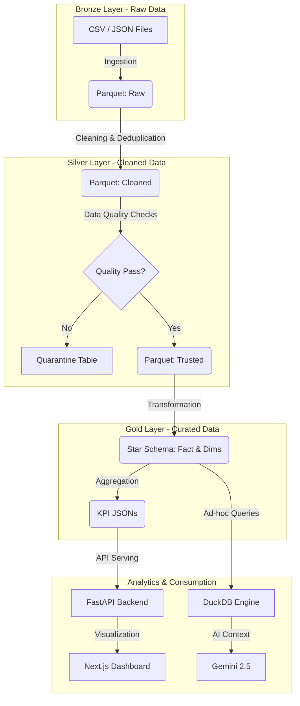

<p align="center">
  <h1 align="center">🧠 Retail Data Hub</h1>
  <p align="center">
    <strong>Smart Retail Supply Chain & Customer Intelligence Platform</strong>
  </p>
  <p align="center">
    A full-stack data engineering project demonstrating ETL pipelines, Medallion Architecture, star schema modeling, automated data quality, KPI analytics, a FastAPI backend, and an interactive Next.js dashboard — all at zero infrastructure cost.
  </p>
</p>

---

## ✨ Highlights

| Capability | Implementation |
|---|---|
| **Architecture** | Medallion (Raw → Bronze → Silver → Gold) with Parquet storage |
| **Cloud/AI** | Native Gemini 2.0 Flash with automated tool-calling |
| **Data Modeling** | Star schema with fact & dimension tables, SCD Type 2 |
| **Ingestion** | Batch (CSV) + near real-time (JSON) with schema validation |
| **Data Quality** | 7 automated checks with JSON evidence reports |
| **Analytics** | Commercial, Operations, Customer KPIs + Market Basket (Apriori) |
| **API** | FastAPI backend serving Gold layer KPIs with Swagger docs |
| **Dashboard** | Interactive Next.js 14 app with Recharts & Tailwind CSS |
| **Query Engine** | DuckDB — in-process SQL directly on Parquet files |

---

## 🏗️ Architecture



---

## 📂 Project Structure

```
retail-data-hub/
│
├── data/                              # Data layers (Raw → Bronze → Silver → Gold)
├── src/                               # Python source (ETL, Quality, ML, API)
├── dashboard/                         # Next.js 14 Dashboard
├── scripts/                           # Automation scripts
└── docs/                              # Technical documentation
```

---

## 🚀 Quick Start (WSL / Linux / macOS)

These instructions are optimized for **WSL (Ubuntu)**, Linux, and macOS.

### 1. Prerequisites
- **Python 3.9+**
- **Node.js 18+** & npm
- **Gemini API Key** (Set in `.env`)

### 2. Implementation & Setup

```bash
# Clone the repository
git clone https://github.com/ayushmaninbox/retail-data-hub.git
cd retail-data-hub

# Make scripts executable
chmod +x scripts/*.sh

# Run the installation script (Auto-venv, deps, and folders)
./scripts/installation.sh
```

Start this once the pipeline data is ready.

**macOS / Linux:** `./scripts/api.sh`  
**Windows:** `python src/api/api.py`

> 🟢 FastAPI runs on **http://localhost:8000** | 📚 Docs: **http://localhost:8000/docs**

---

### 🖥️ Step 3: Terminal 3 — Start Dashboard
Keep this running to show the final visualization.

**macOS / Linux:** `./scripts/dashboard.sh`  
**Windows:** `cd dashboard && npm run dev`

> 🟢 Next.js dashboard on **http://localhost:3000**

---

## 🖥️ Dashboard Pages

The dashboard is a **Next.js 14** app built with **TypeScript**, **Tailwind CSS**, and **Recharts**. It fetches live data from the FastAPI backend.

| # | Page | Route | What You'll See |
|---|---|---|---|
| 1 | 🏠 **Overview** | `/` | Revenue, orders, customers, avg transaction KPI cards + revenue trend |
| 2 | 📊 **Sales Analytics** | `/sales` | City-wise sales, top products, channel mix, monthly trends |
| 3 | 📦 **Inventory Health** | `/inventory` | Stockout alerts, turnover ratio, reorder recommendations |
| 4 | 🚚 **Logistics** | `/logistics` | Avg delivery time, delay distribution, seasonal demand |
| 5 | 👥 **Customers** | `/customers` | New vs returning, CLV distribution, RFM segments |
| 6 | 🛒 **Market Basket** | `/market-basket` | Item associations, confidence scores, recommendation pairs |
| 7 | ✅ **Data Quality** | `/data-quality` | Pipeline health, row counts, check pass/fail status |

---

## 🚀 API Endpoints

The FastAPI backend serves pre-computed KPI data from the Gold layer as JSON:

| Method | Endpoint | Description |
|---|---|---|
| `GET` | `/api/health` | Health check + data file status |
| `GET` | `/api/overview` | Combined summary for the Overview page |
| `GET` | `/api/commercial` | Revenue, city sales, top products, channel mix |
| `GET` | `/api/operations` | Inventory turnover, stockout rate, delivery times |
| `GET` | `/api/customers` | CLV, RFM segmentation, new vs returning |
| `GET` | `/api/market-basket` | Market Basket Analysis (Apriori) results |
| `GET` | `/api/data-quality` | Data quality report |
| `GET` | `/api/sales` | Sales-specific data (derived from commercial) |
| `GET` | `/api/inventory` | Inventory-specific data (derived from operations) |
| `GET` | `/api/logistics` | Logistics-specific data (derived from operations) |

---

## 🔑 Key KPIs

### 📈 Commercial
- Daily / monthly revenue aggregation
- City-wise sales breakdown (10 Indian cities)
- Top 10 products by quantity sold
- Channel mix — POS vs Web revenue split
- Category-level revenue analysis

### 📦 Operations
- Inventory turnover ratio per product/store
- Average delivery time per route
- Stockout rate (% of products with zero stock)
- Seasonal demand trends (monthly quantity by category)
- Reorder point alerts

### 👥 Customer
- New vs returning customer counts
- Customer Lifetime Value (CLV)
- RFM segmentation (Recency · Frequency · Monetary)

### 🛒 AI / ML
- Market basket analysis using **Apriori algorithm**
- Standard, cross-channel, and category-level association rules
- Support, confidence & lift scores

---

## 🛡️ Data Quality Framework

Seven automated checks run at every pipeline stage:

| # | Check | Rule | On Failure |
|---|---|---|---|
| 1 | No negative prices | `unit_price >= 0` | Quarantine row |
| 2 | No future dates | `date <= today()` | Reject row |
| 3 | No null customer IDs | `customer_id IS NOT NULL` | Fill "UNKNOWN" |
| 4 | No duplicates | Composite key uniqueness | Drop duplicate |
| 5 | Referential integrity | FK exists in dimension | Reject orphan |
| 6 | Quantity range | `1 <= qty <= 10,000` | Flag outlier |
| 7 | Column completeness | `% non-null per column` | Report metric |

Results are saved as `data/data_quality_report.json` and visualized in the Data Quality dashboard page.

---

## 🧰 Tech Stack

| Layer | Technology |
|---|---|
| **Language** | Python 3.9+ · TypeScript |
| **Data Generation** | Faker, Pandas, NumPy |
| **Storage Format** | Apache Parquet (columnar, compressed) |
| **Query Engine** | DuckDB (in-process OLAP) |
| **Transformations** | Pandas, DuckDB SQL |
| **ML / Analytics** | mlxtend (Apriori), scikit-learn, Pandas |
| **API Backend** | FastAPI + Uvicorn |
| **Dashboard** | Next.js 14 + React 18 + TypeScript |
| **Charts** | Recharts |
| **Styling** | Tailwind CSS |
| **UI Components** | Lucide React (icons) |
| **Automation** | Shell scripts (Bash) |

---

## 📜 Scripts Reference

All scripts live in `scripts/` and auto-detect the project root + activate the virtual environment:

| Script | Purpose |
|---|---|
| `installation.sh` | Creates venv, installs Python deps + npm packages, sets up data dirs |
| `cleanup.sh` | Resets demo state by wiping Silver, Gold, and Analytics layers |
| `generation.sh` | Generates synthetic POS, Web Order, and Warehouse data |
| `ingestion.sh` | Ingests raw CSV/JSON into Bronze layer Parquet files |
| `transform.sh` | Runs Bronze → Silver → Gold transformations (incl. SCD2) |
| `quality_checks.sh` | Runs 7 data quality checks, generates report |
| `kpi_analysis.sh` | Executes all 4 KPI analytics scripts, outputs JSON |
| `forecast.sh` | Trains LSTM AI brain and generates demand forecasts |
| `api.sh` | Starts the FastAPI server on port 8000 |
| `dashboard.sh` | Starts the Next.js dev server on port 3000 |

---

## 📄 Documentation

Detailed docs live in the [`docs/`](docs/) directory:

| Document | Description |
|---|---|
| [architecture.md](docs/architecture.md) | Medallion Architecture deep-dive, design decisions, trade-offs |
| [architecture_diagram.png](docs/architecture_diagram.png) | Visual system architecture diagram |
| [data_quality.md](docs/data_quality.md) | Full DQ rule catalog, thresholds, and sample evidence |
| [storage_security_plan.md](docs/storage_security_plan.md) | Parquet partitioning strategy, RBAC, encryption, audit logging |

---

## 🎯 Demo Flow (for Judges)

1. **Show empty `data/` folders** — *"We start from zero"*
2. **Run the pipeline** (Steps 1–5 in Terminal 1) — narrate each medallion layer
3. **Start API** (Terminal 2) — show Swagger docs at `/docs`
4. **Start Dashboard** (Terminal 3) — walk through all 7 pages
5. **Highlight the journey**: Raw CSV → Parquet → Star Schema → KPIs → REST API → Dashboard

---

## 🤝 Contributing

1. Fork the repo
2. Create a feature branch (`git checkout -b feature/amazing-feature`)
3. Commit your changes (`git commit -m 'Add amazing feature'`)
4. Push to the branch (`git push origin feature/amazing-feature`)
5. Open a Pull Request

---

## 📜 License

This project is built for a hackathon and is open for educational use.

---

<p align="center">
  Built with ❤️ by <strong>Team SixSevenCoders</strong>
</p>
