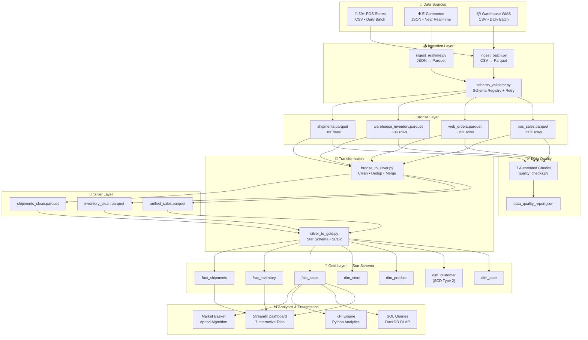
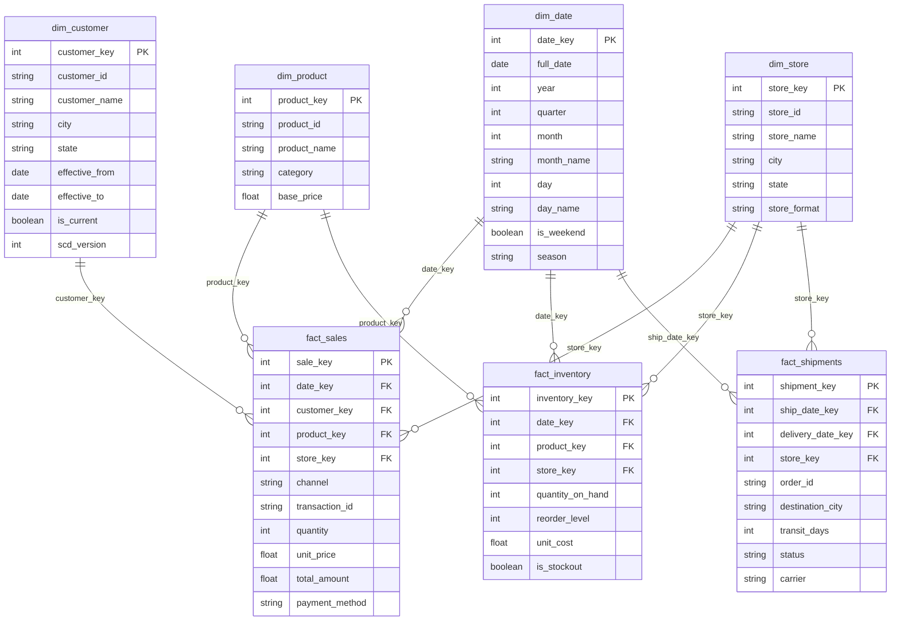

# 🏗️ Architecture — Retail Data Hub

## 1. System Overview

The Retail Data Hub follows the **Medallion Architecture** (Bronze → Silver → Gold) pattern,
providing a scalable and maintainable data pipeline that transforms raw, siloed retail data
into analytics-ready star schema tables.

```
┌──────────────────────────────────────────────────────────────────────────────────┐
│                              DATA SOURCES                                       │
│                                                                                  │
│       50+ POS Stores          E-Commerce Portal         Warehouse WMS           │
│       (CSV, daily batch)      (JSON, near real-time)    (CSV, daily batch)      │
└────────┬──────────────────────────────┬────────────────────────┬─────────────────┘
         │                              │                        │
         ▼                              ▼                        ▼
┌──────────────────────────────────────────────────────────────────────────────────┐
│  📥 INGESTION LAYER (src/ingestion/)                                            │
│                                                                                  │
│  ingest_batch.py          ingest_realtime.py          schema_validator.py        │
│  ├─ CSV reader            ├─ JSON reader              ├─ Schema registry        │
│  ├─ Schema validation     ├─ Schema validation        ├─ Type coercion          │
│  ├─ Retry w/ backoff      ├─ Retry w/ backoff         ├─ Missing col fill       │
│  └─ Write Parquet         └─ Write Parquet            └─ Ingestion logging      │
└──────────────────────────────────┬───────────────────────────────────────────────┘
                                   │
                                   ▼
┌──────────────────────────────────────────────────────────────────────────────────┐
│  🥉 BRONZE LAYER (data/bronze/)                                                 │
│                                                                                  │
│  Append-only, schema-validated Parquet files                                    │
│  ├── pos_sales/pos_sales.parquet         (~50,000 rows, 11 columns)             │
│  ├── web_orders/web_orders.parquet       (~15,000 rows, 13 columns)             │
│  ├── warehouse/warehouse_inventory.parquet (~50,000 rows, 9 columns)            │
│  └── warehouse/shipments.parquet         (~8,000 rows, 8 columns)               │
└──────────────────────────┬──────────────────────┬────────────────────────────────┘
                           │                      │
                  ┌────────┘                      │
                  ▼                               ▼
┌─────────────────────────────────┐  ┌────────────────────────────────────────────┐
│  ✅ DATA QUALITY CHECKS         │  │  🔄 TRANSFORMATION LAYER                   │
│  (src/quality/)                 │  │  (src/transformation/)                     │
│                                 │  │                                            │
│  7 automated rules:             │  │  bronze_to_silver.py                       │
│  1. No negative prices          │  │  ├─ Dedup on composite keys               │
│  2. No future dates             │  │  ├─ Null imputation                        │
│  3. No null customer IDs        │  │  ├─ Business logic validation              │
│  4. No duplicate rows           │  │  ├─ Channel unification (POS + Web)        │
│  5. Referential integrity       │  │  └─ Write to Silver Parquet                │
│  6. Quantity range checks       │  │                                            │
│  7. Column completeness         │  │  silver_to_gold.py                         │
│  ─────────────────────────     │  │  ├─ SCD Type 2 (customer dim)              │
│  Output:                        │  │  ├─ Surrogate key generation               │
│  data_quality_report.json       │  │  ├─ Star schema assembly                   │
└─────────────────────────────────┘  │  └─ Date-partitioned Parquet output        │
                                     └─────────────────┬──────────────────────────┘
                                                       │
                                                       ▼
┌──────────────────────────────────────────────────────────────────────────────────┐
│  🥈 SILVER LAYER (data/silver/)                                                 │
│                                                                                  │
│  Cleaned, deduplicated, type-corrected data                                     │
│  ├── unified_sales.parquet       (POS + Web merged, clean)                      │
│  ├── inventory_clean.parquet     (duplicates removed, validated)                │
│  └── shipments_clean.parquet     (orphans rejected, dates fixed)                │
└──────────────────────────────────────────┬───────────────────────────────────────┘
                                           │  star schema + SCD Type 2
                                           ▼
┌──────────────────────────────────────────────────────────────────────────────────┐
│  🥇 GOLD LAYER (data/gold/)  —  Star Schema                                    │
│                                                                                  │
│  DIMENSION TABLES                    FACT TABLES                                │
│  ├── dim_date.parquet                ├── fact_sales.parquet                      │
│  ├── dim_customer.parquet (SCD2)     ├── fact_inventory.parquet                  │
│  ├── dim_product.parquet             └── fact_shipments.parquet                  │
│  └── dim_store.parquet                                                          │
│                                                                                  │
│  Partitioned by: date (monthly), region (city)                                  │
└──────────────────────────────┬───────────────────────────────────────────────────┘
                               │
              ┌────────────────┼────────────────┐
              ▼                ▼                ▼
┌───────────────────┐ ┌────────────────┐ ┌──────────────────────┐
│ 📊 DASHBOARD      │ │ 📝 SQL QUERIES │ │ 📈 ANALYTICS ENGINE  │
│ (Streamlit +      │ │ (sql/)         │ │ (src/analytics/)     │
│  Plotly)          │ │                │ │                      │
│ 7 interactive     │ │ Pure SQL KPIs  │ │ KPI computation      │
│ tabs covering     │ │ running on     │ │ Market Basket (ML)   │
│ all KPI           │ │ DuckDB OLAP   │ │ RFM segmentation     │
│ categories        │ │ engine         │ │ CLV analysis         │
└───────────────────┘ └────────────────┘ └──────────────────────┘
```

---

## 2. Data Flow Diagram (Mermaid)



---

## 3. Star Schema ERD



---

## 4. Design Decisions & Trade-offs

### Why Medallion Architecture?

| Decision | Rationale |
|---|---|
| **Bronze = raw Parquet** | Preserves source fidelity; schema validation at write time catches format drift early |
| **Silver = cleaned** | Single layer for dedup, null handling, type coercion — avoids over-engineering |
| **Gold = star schema** | Optimized for analytical queries; DuckDB and BI tools work best with star models |

### Why DuckDB over Spark / BigQuery?

| Factor | DuckDB | Spark / Cloud |
|---|---|---|
| Setup | `pip install duckdb` | Cluster provisioning, cloud accounts |
| Cost | $0 | $$$$ |
| Performance (at our scale) | ~50ms per query on 50K rows | Overkill |
| Portability | Runs anywhere Python does | Cloud-dependent |
| Hackathon fit | ✅ Perfect | ❌ Over-engineered |

### Why Parquet?

- **Columnar** — only reads needed columns in analytical queries
- **Compressed** — 5-10× smaller than CSV, lower disk I/O
- **Schema enforcement** — types are preserved on disk, no CSV parsing ambiguity
- **Ecosystem** — native support in Pandas, DuckDB, Spark, Polars

### Schema Evolution Strategy

The `schema_validator.py` module handles format changes:
- **Missing columns** → filled with safe defaults (`"UNKNOWN"`, `0`, `NaT`)
- **Extra columns** → kept, logged as warning (backward-compatible)
- **Type drift** → coerced with fallbacks (e.g., `pd.to_numeric(errors="coerce")`)
- **strict mode** → can raise on missing columns for critical pipelines

### Retry & Resilience

All ingestion functions use the `@retry_with_backoff` decorator:
- 3 attempts max
- Exponential backoff (1s → 2s → 4s)
- Catches transient I/O failures (network mounts, locked files)

---

## 5. Data Volume Summary

| Dataset | Rows | Columns | Format | Source |
|---|---|---|---|---|
| POS Sales | ~50,000 | 11 | CSV → Parquet | 50+ stores, 2 years, 160+ products |
| Web Orders | ~15,000 | 13 | JSON → Parquet | E-commerce, UPI/CC/COD payments |
| Warehouse Inventory | ~50,000 | 9 | CSV → Parquet | Monthly snapshots, 50+ stores |
| Shipments | ~8,000 | 8 | CSV → Parquet | 7 carriers, delivery tracking |

**Total:** ~123,000 records across 4 datasets, covering Jan 2023 – Jan 2025.
